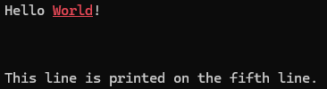

# Coded chars

This crate implements the ECMA-48 standard for coded characters in rust.

Various constructions are provided to easily add control character and sequences inside text.
This crate is compatible with "ANSI terminals".

This crate does not use a concept of "styles" or any kind of abstraction other than ones defined in the standard.

### Standard implemented

- [ecma-48](https://ecma-international.org/publications-and-standards/standards/ecma-48/) - Control Functions for Coded Character Sets

### Documentation

[On docs.rs](https://docs.rs/coded-chars/latest/coded_chars/)

### An example

```rust
use coded_chars::clear_screen;
use coded_chars::cursor::set_position;
use coded_chars::presentation::{format_str, select_graphic};

fn main() {
    // Direct format
    println!("Hello {}World{}!", select_graphic().fg_red().bold().underline(), select_graphic().default());

    // Clear screen
    clear_screen();

    // Using format_str
    let fmt_world = format_str(
        "World",
        select_graphic().fg_red().bold().underline()
    );
    println!("Hello {fmt_world}!");

    set_position(5, 1).exec();
    println!("This line is printed on the fifth line.");
}
```

Result:  



### Current status

This crate development is achieved.

Contact the author at [dev@trehinos.eu](mailto:dev@trehinos.eu).

### License
&copy; 2024 Sébastien Geldreich  
MIT License